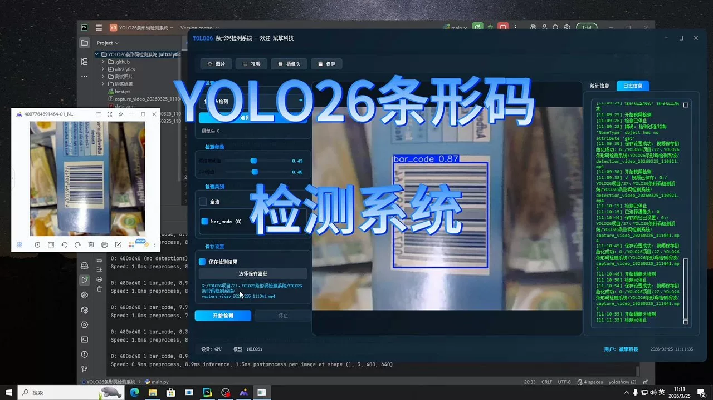
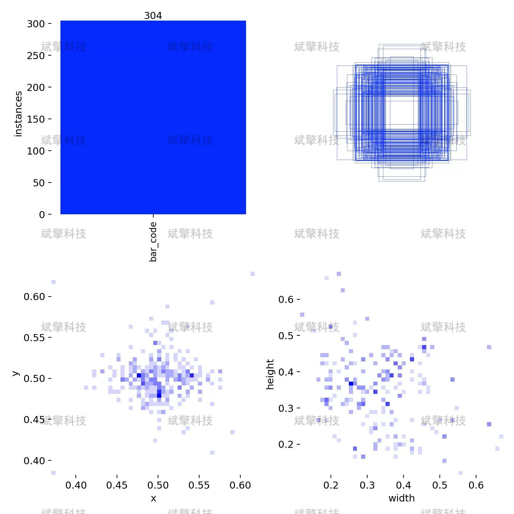
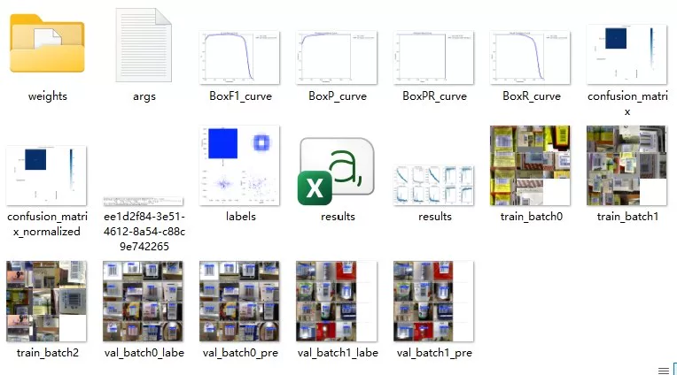
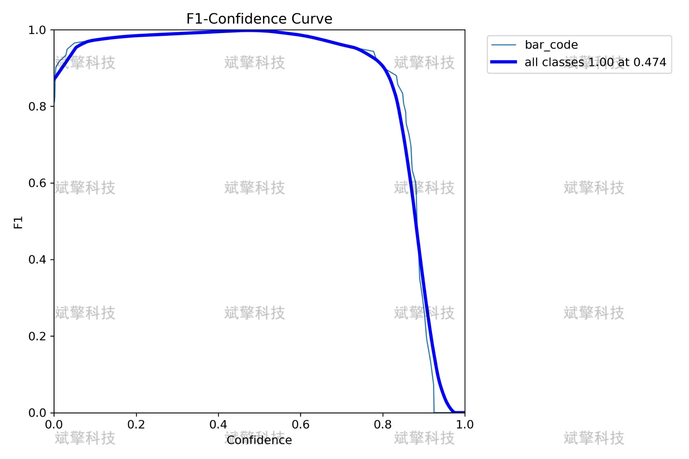
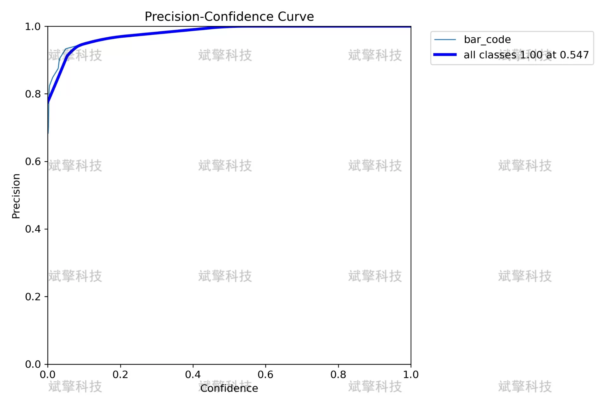
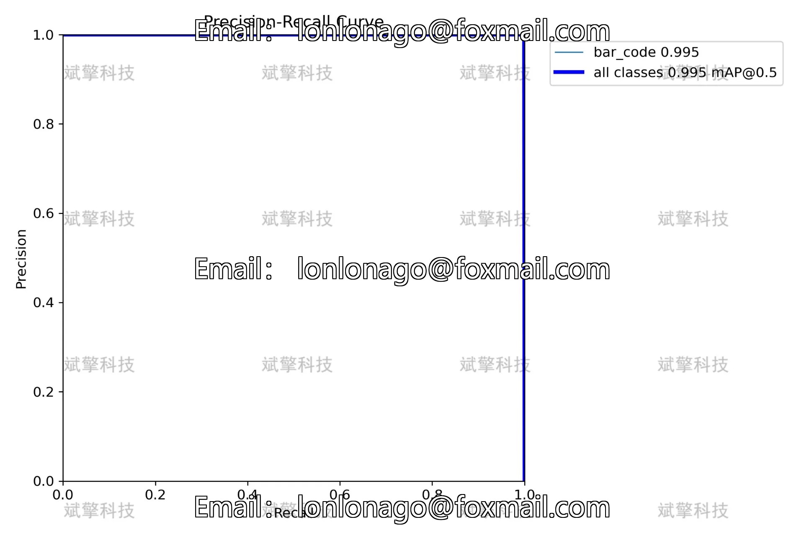
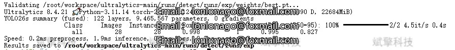
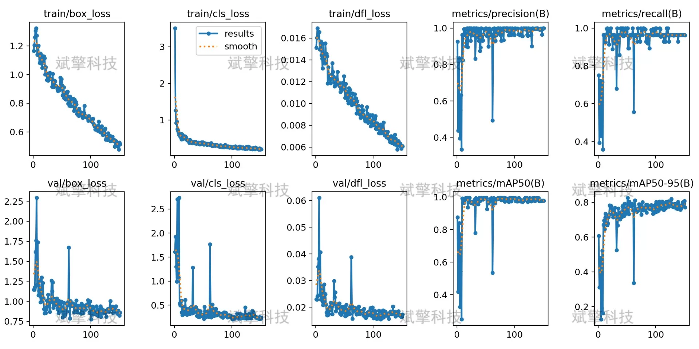
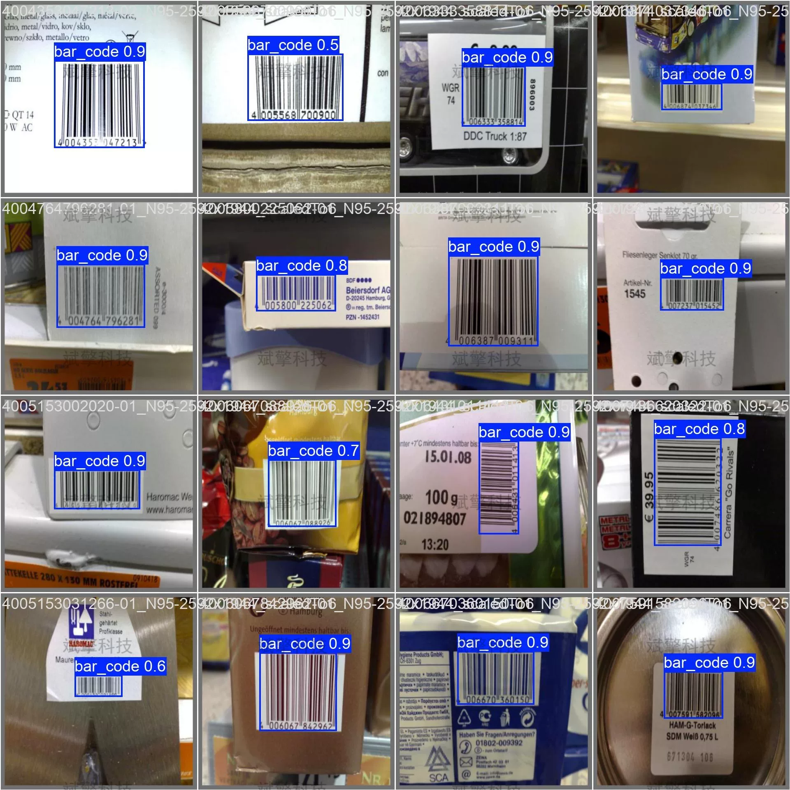

# YOLOv2 barcode detection system | dataset + source code

## Body

YOLO26 Barcode Detection System | Data Set + Source Code from Scratch: Training, Evaluation, and Deployment Guide for YOLO26 Barcode Detection System

This article introduces a target detection system based on the YOLO26 architecture, specifically designed for barcode detection. The system is trained on a dataset containing 301 training images and 28 validation images, with only one category (bar_code).
Experimental results show that the model achieved an accuracy of 0.998, a recall of 1.000, an mAP@0.5 of 0.995, and an mAP@0.5:0.95 of 0.827 in the validation set. A confusion matrix analysis indicates that the model achieves perfect detection with zero false positives and zero missed detection.
The system performs excellently across various confidence thresholds, with a F1 score reaching 1.00 at a confidence threshold of 0.474, confirming the reliability and stability of the model in practical applications.
Number of Categories: Single-class (bar_code)
Category Name: ['bar_code']
Training Set: 301 images
Validation Set: 28 images

Free appointment for remote installation. Unsuccessful installation will result in a full refund.
Purchase includes the following resources (unlocked through Baidu Cloud):
   - Complete source code for YOLO recognition detection project
   - YOLO format datasets
   - Training code + UI interface code
   - Trained model + results images
   - Software installation package
   - Add WeChat to make a reservation for remote installation (displayed WeChat ID after purchase) - Unsuccessful, full refund guaranteed

⚙️ Core Function Modules
Detection Capabilities
    Image Detection: Upon upload, returns detection boxes + category information
    Video Detection: Supports video files, analyzes frames accurately
    Camera Real-Time Detection: Connects to USB cameras to achieve dynamic monitoring
Interaction and Control
    Target Selection: Choose one or more categories for detection freely
    Parameter Real-Time Adjustment: Adjustable confidence threshold & IoU threshold, flexible control over precision
    Result Save: One-click save of image/video/camera detection results
System and Data
    User Login and Registration: Supports password strength checking + encryption storage
    Log Recording: Records operation and error information automatically (timestamped)

## Images

## Payment

Here is a pay link on Stripe ( https://buy.stripe.com/3cs8yP7sY87d0vu9AB ). Please contact me lonlonago@foxmail.com after funding $89, and I will send you a complete data files , thank you!

